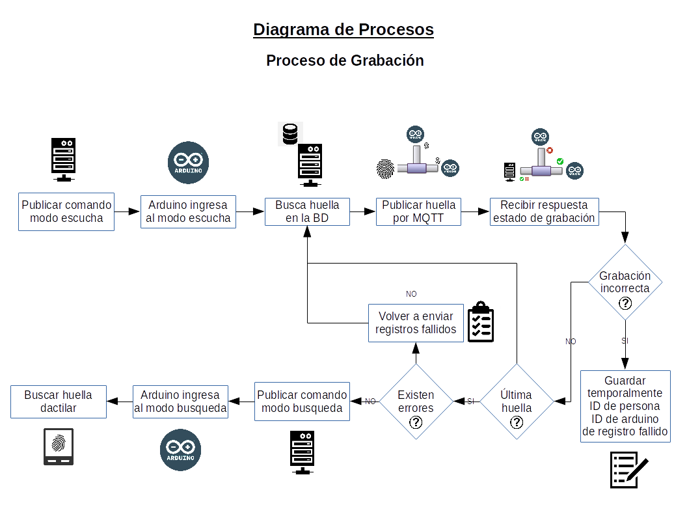
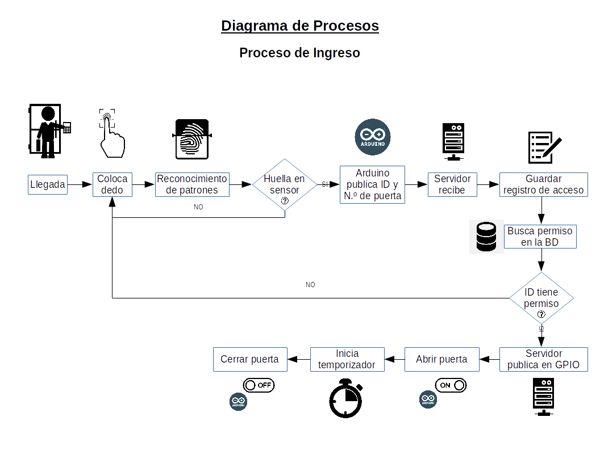
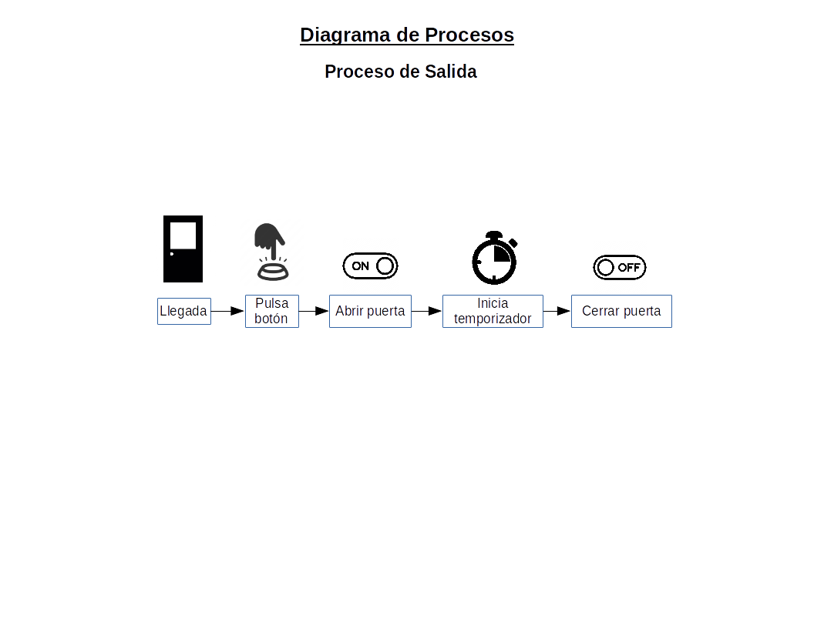
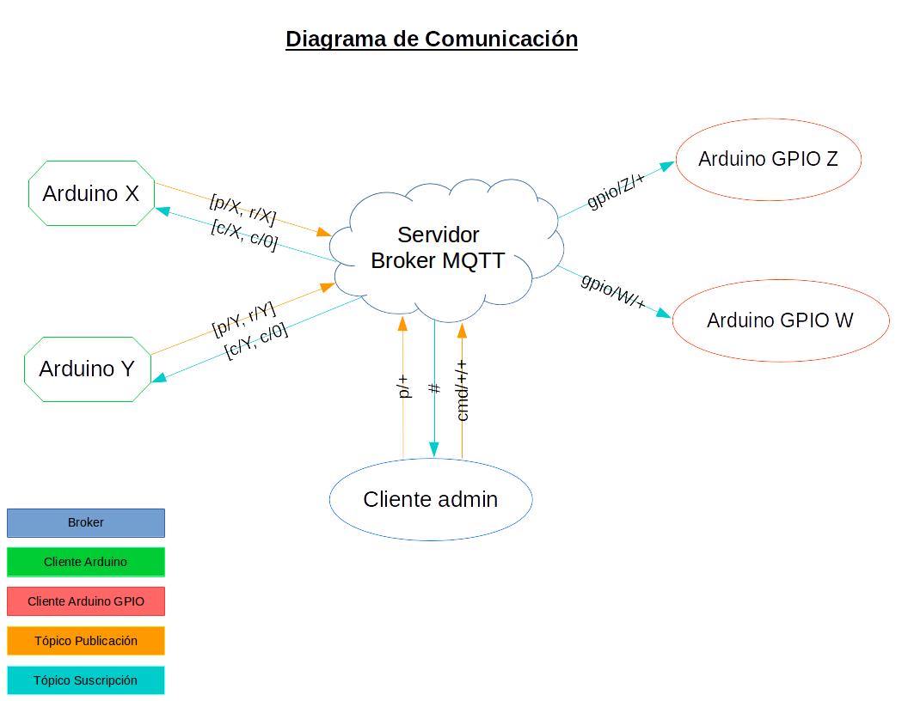
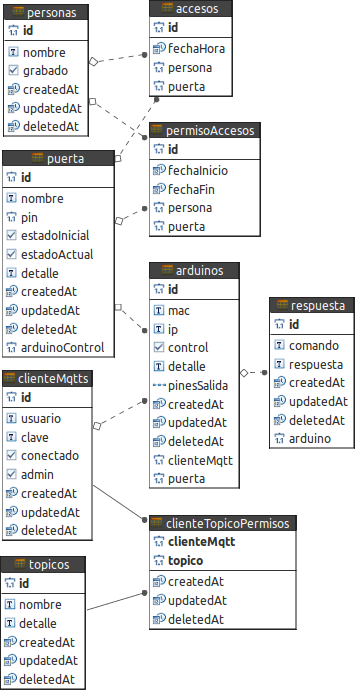

# Sistema de control de accesos mediante sensor biométrico de huella dactilar

Los sistemas de identificación biométrica se basan en características únicas que posee cada individuo, que lo distinguen de los otros indivíduos. Una de ellas son las huellas dactilares; este sistema utiliza el reconocimiento de huellas dactilares para identificar a las personas y darles acceso a diferentes ambientes mediante un sensor biométrico ZFM-20, combinado con un [módulo desarrollado en hardware libre](https://github.com/djimenezjerez/control_accesos_hardware), que se encarga de controlar las funciones almacenadas en el sensor y también enviar los datos de las personas que colocan su huella hasta el servidor broker MQTT.

## Requisitos

* [Hardware registrador](https://github.com/djimenezjerez/control_accesos_registrador)
* [Hardware de interfaz sensorial y control de puertas](https://github.com/djimenezjerez/control_accesos_hardware)
* [Frontend de administración del sistema](https://github.com/djimenezjerez/control_accesos_frontend)

## Componentes del protocolo MQTT

### MQTT

Mejor conocido como Mosquitto, es un estandar ISO/IEC PRF 20922. Es un protocolo de mensajería Máquina-Máquina (M2M), caracterizado por ser liviano en cuante a longitud de paquete diseñado para conectar dispositivos IoT (Internet de las cosas).

### Broker

El broker es un servidor que autoriza las conexiónes de los clientes que deseen conectarse para suscribirse o publicar en un tópico.

### Cliente

Es un dispositivo de hardware o software que se conecta a un broker para escuchar las publicaciones de un tópico o publicar en uno.

### Tópico

Es un nombre particular de un canal al cual se pueden suscribir uno o más dispositivos, desde el cual recibiran todas las publicaciones que el broker u otro dispositivo realice.

## Diagrama de procesos

### Grabación de huellas

La grabación de nuevas huellas comienza con una orden al servidor para que establezca el modo escucha en los dispositivos de interfaz sensorial y acto seguido envía los datos de cada una de las huellas a grabar hacia los sensores mediante el dispositivo interfaz.



### Ingreso

El proceso de ingreso comienza cuando una persona se acerca a una puerta y coloca su huella en el sensor, el sensor verifica que esta huella se halla en su base de datos y si es así envía el ID de la persona que intenta ingresar, caso contrario el sensor responde con una respuesta nula. Una vez que se há obtenido el ID del sensor el dispositivo de hardware embebido envía este mismo ID al servidor broker MQTT, este verifica que dicha persona tenga permiso para acceder por esa puerta, si es así el servidor envia la orden de abrir dicha puerta al arduino de control relacionado con esa puerta, caso contrario registra el intento de acceso pero no envía la orden de apertura. Pasado un tiempo definido el servidor envía la orden de cerrar la puerta que se acaba de abrir.



### Salida

Para que una persona pueda salir de un ambiente, debe pulsar el botón, este desenergiza temporalmente la chapa, para activarla nuevamente después.



## Diagrama de comunicación



La lista de tópicos MQTT que maneja el sistema es:

### Tópico de comandos en el servidor

cmd/:comando/:destino : Comandos definidos en el servidor para realizar diferentes acciones en los sensores, donde comando es el comando a ejecutar y destino es el id del arduino o 0 para todos los arduinos. El mensaje es el id o los ids de las huellas que se desea grabar. Ejemplo:

```sh
cmd/grabar/0  :  1,2,10
```

### Tópico de comandos en el sensor

c/:destino : Comandos que realizarán los sensores mediante el el módulo de interfaz sensorial, donde destino es el id del arduino o 0 para todos los arduinos. El mensaje es un comando de acuerdo al [manual del sensor biométrico](./doc/ZFM_user_manualV15.pdf), aumentado dos bytes al inicio del paquete; el primer bytes es el tamaño de la respuesta del sensor después de ejecutar el comando, el segundo byte es la posición donde se encuentra el comando de respuesta de acuerdo al manual del sensor. Antes de realizar cualquier operación en los sensores se los debe poner en modo escucha, mediante le publicación de:

```sh
c/0  :  0
```

Con esto las interfaces actuarán como un puente entre el servidor y los sensores enviando una orden para ejecutar algún tipo de comando. Por ejemplo para realizar la operación handshake:

```sh
c/0  :  0c09ef01ffffffff0100041700001c
```

Se recibirá una respuesta en el tópico r/:arduinoId, de todos los sensores donde se haya ejecutado la orden, para que los sensores vuelvan al estado de control de lectura biométrica se debe realizar la publicación:

```sh
c/0  :  1
```

### Tópico de respuestas de los sensores

r/:arduinoId : Byte de respuesta proveniente de cada sensor después de la ejecución de algún comando, donde arduinoId es el id del arduino. Por ejemplo después de la ejecución de algún comando se recibirá una respuesta:

```sh
r/1  :  00
```

Que de acuerdo al manual significa estado "correcto".

### Tópico de intentos de acceso

p/:puertaId : Tópico de puerta, donde puertaId es el id de la puerta relacionada con el arduino interfaz. Por ejemplo para decir que una persona con el ID 64 intenta ingresar por la puerta 2 se publica:

```sh
p/2  :  64
```

### Tópico de activación/desactivación de GPIO

gpio/:arduinoId/:pin : Tópico de control de puertas, donde arduinoId es el id del arduino de control y pin es el pin que se quiere activar o desactivar. Por ejemplo para cambiar el estado de 0 al estado 1 del pin 9 en el arduino de control con el id 3 se publica:

```sh
gpio/3/9  :  1
```

### Creación de tópicos automática



La base de datos contiene un modelo de datos llamado Arduino, este puede albergar a dos tipos de arduino, el de control de puertas y el de interfaz sensorial.

Cuando se agrega un arduino de control de puertas, automáticamente se crea un tópico con el identificador "gpio/:arduinoId/+", donde arduinoId es el ID del arduino insertado, a su vez se le concede permisos de suscripción a dicho tópico al cliente MQTT relacionado con este arduino.

Cuando se agrega un arduino de interfaz sensorial, automáticamente se crean cuatro tópicos, r/:arduinoId, p/:puertaId con permiso de publicación y c/:arduinoId, c/0, con permiso de suscripción.

## Documentación

* [Manual de instalación](./INSTALL.md)
* [Licencia LPG-Bolivia](https://softwarelibre.gob.bo/licencia.php)
